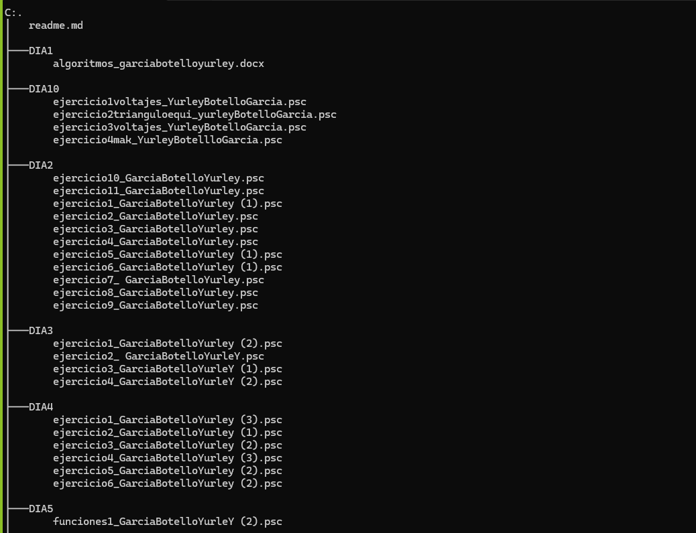
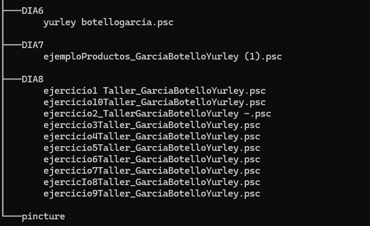

## TALLER DE RECUPERACIÓN PSEINT

Cuenta  con varios ejercicios desarrollados en pseint

## Tabla De Contenido

| Índice | Título |
|--|------|------|
| 1 | Dia1 |Algoritmos |
| 2 | Dia2 | Ejercicios metodologícos|
| 3 | Dia 3| algoritmos lógicos|
| 4 | Dia 4 |funciones básica|
| 5 | Dia 5 |Ciclos|
| 6 | Dia 6| Funciones|
| 7 | Dia 7|CRUD|
| 8 | Dia 8| Arrays|
| 9 | Dia 10| Ejercicios metodologícos|
## Instalación

Deberas ejecutar el siguiente comando para clonar el repositorio y ver cada uno de los proyectos  desde tu maquina local:
 
Gith Bash

~~~ 
git clone  "link del repositorio" https://github.com/YurleyBG/carpetatalleres_yurleybotellog.git
~~~
al hacer esto se descargará  los datos del repositorio. puedes usar  la app de pseint para ver cada uno de los ejercicios que se encuentrán ahí.

 ## Tecnología utilizadas

+ Pseint

## Estructura 

## Crédito 
Este taller de recuperación fue desarrollado por Yurley Botello.
